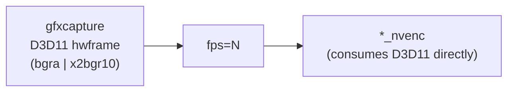
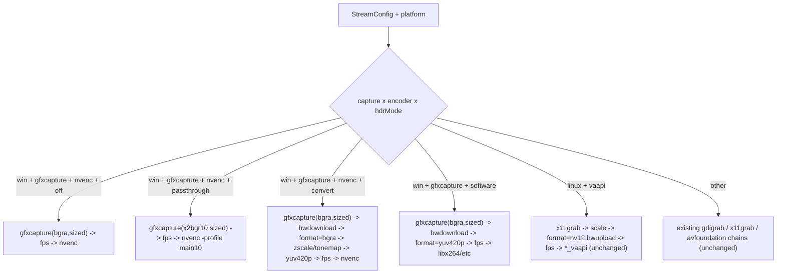

## Why

Three independent claims in `public/streaming/` are not real FFmpeg features:

- `-init_hw_device cuda=cu@dx` — `cuda_device_derive` in `libavutil/hwcontext_cuda.c` only accepts `AV_HWDEVICE_TYPE_VULKAN` as a source; every other type returns `AVERROR(ENOSYS)`.
- `hwmap=derive_device=cuda` from a D3D11 frame — same root cause.
- `gfxcapture=...:output_fmt=nv12` / `output_fmt=p010` — `vsrc_gfxcapture.c`'s `output_fmt` AVOption only accepts `bgra` (`8bit`), `x2bgr10` (`10bit`), `rgbaf16` (`16bit`).

The "legacy fallback" also passes `output_fmt=nv12`, so it is broken too. The whole gfxcapture pipeline currently errors at filter init on the BtbN lgpl-shared build that `[projectscripts/fetch-ffmpeg.js](projectscripts/fetch-ffmpeg.js)` ships.

The right pattern, per the gfxcapture filter doc and `HWAccelIntro` ("NVENC can accept d3d11 frames context directly"), is:



No `-init_hw_device`, no `hwmap`, no CUDA context. NVENC's wrapper handles the D3D11→CUDA registration internally.

## Architecture after the fix



There is no longer a fast/legacy split, no `Capabilities.supportsHwmapCudaFromD3D11`, and no runtime ENOSYS retry.

## Files touched

- Delete [public/streaming/capture/gfxcaptureCuda.js](public/streaming/capture/gfxcaptureCuda.js) and [public/streaming/hwcontexts.js](public/streaming/hwcontexts.js)'s Windows/CUDA branch (keep the VAAPI branch — it's correct).
- Rewrite [public/streaming/capture/gfxcapture.js](public/streaming/capture/gfxcapture.js) to only emit valid `output_fmt` values (`bgra` / `x2bgr10` / `rgbaf16`) plus the existing `width`/`height`/`resize_mode`/`scale_mode` knobs.
- Rewrite [public/streaming/filters/videoFilter.js](public/streaming/filters/videoFilter.js): remove `buildCudaFastPath`, drop the fast-vs-legacy decision, fold HDR-convert (CPU zscale) and HDR-passthrough into one `selectVideoFilter` that always rides D3D11 through to the encoder unless we have to drop to RAM (HDR convert, software encoders).
- [public/streaming/pipeline.js](public/streaming/pipeline.js): drop `defaultCapabilities.supportsHwmapCudaFromD3D11`, drop `fallbackOnFailure`, drop `usedFastPath`. Update the spawn-side caller (`public/electron-live-stream.js`) to remove the ENOSYS retry loop.
- [public/streaming/encoder/nvenc.js](public/streaming/encoder/nvenc.js): for `hdrMode==="passthrough"` add `-profile:v main10` (HEVC) / `-profile:v high10` (AV1) and `-pix_fmt p010le`; fix the comment that claims `tonemap_cuda` is the SDR source for the `hdrMode==="convert"` BT.709 metadata block (it's CPU `tonemap=hable` now).
- Update [public/streaming/__tests__/pipeline.test.js](public/streaming/__tests__/pipeline.test.js): collapse `winFastPath` / `winLegacy` into one `winCaps`; replace the `output_fmt=nv12` / `hwmap=derive_device=cuda` snapshot strings with the real argv (see snippets below); delete the "Windows legacy fallback" describe block; keep VAAPI / mac / gdigrab / QSV / fps-ceiling tests as-is.
- [CHANGELOG.md](CHANGELOG.md): one entry noting the correction.

## Decisions baked in

- **HDR convert stays on CPU** (zscale + `tonemap=hable`). The on-GPU alternative requires a Vulkan-as-bridge device (`d3d11va -> vulkan -> cuda -> tonemap_cuda`); deferred as a separate change.
- **SDR rides BGRA into NVENC**, not NV12. NVENC's encoder does the BGRA→NV12 pixel-format conversion on its own GPU surfaces; this is one fewer filter and matches the `gfxcapture=...:output_fmt=10bit -c:v hevc_nvenc` example in the FFmpeg docs.
- **HDR passthrough rides X2BGR10 into NVENC.** Need to verify NVENC accepts X2BGR10 as input — if not, fall back to `hwdownload -> format=p010le -> nvenc` (still cheaper than the CPU zscale path).

## Test snapshot deltas (illustrative)

Before:
```
"gfxcapture=...:output_fmt=nv12,hwmap=derive_device=cuda:mode=read,fps=60[v]"
```

After (SDR):
```
"gfxcapture=monitor_idx=0:max_framerate=60:capture_cursor=1:width=1920:height=1080:resize_mode=scale_aspect:output_fmt=bgra,fps=60[v]"
```

After (HDR passthrough):
```
"gfxcapture=...:output_fmt=x2bgr10,fps=60[v]"
```

After (HDR convert, unchanged conceptually):
```
"gfxcapture=...:output_fmt=bgra,hwdownload,format=bgra,zscale=t=linear:npl=100,format=gbrpf32le,zscale=p=bt709,tonemap=hable:desat=0,zscale=t=bt709:m=bt709:r=tv,format=yuv420p,fps=60[v]"
```

## Commit shape

1. Cleanup: delete `gfxcaptureCuda.js`, drop `supportsHwmapCudaFromD3D11`, drop `fallbackOnFailure` / spawn retry, rip the CUDA branch out of `hwcontexts.js`. Tests temporarily red.
2. Rewrite `gfxcapture.js` + `videoFilter.js` against the real option set; HDR convert path preserved verbatim.
3. NVENC HDR profile/pixfmt fixes + test snapshots + CHANGELOG.